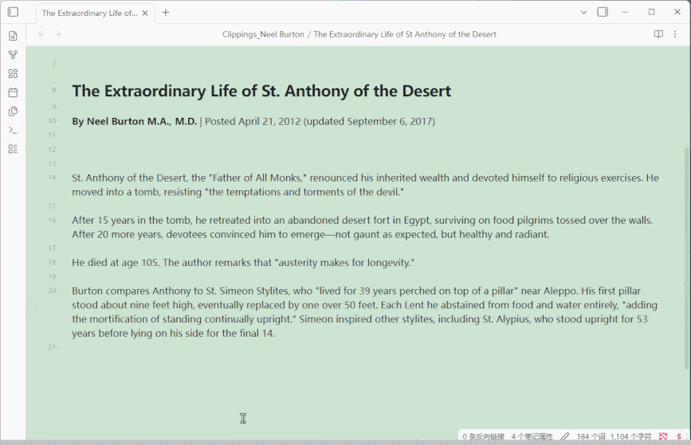
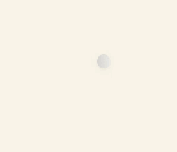

# SwiftSwitch

Quickly toggle Obsidian CSS Snippets from a status bar popup.

## Features

- **Status Bar Button** — Click the SwiftSwitch button in the status bar to open the management popup
- **Toggle Snippets** — Click any snippet chip to enable/disable it instantly
- **Custom Groups** — Right-click empty space to add groups, then drag snippets into them
- **Drag & Drop** — Drag snippet chips between groups or back to "Ungrouped"
- **Fold/Expand Groups** — Click group header to collapse/expand, state is persisted
- **i18n** — Switch between Chinese and English via the CN/EN toggle in the popup header
- **Right-click Menu** — Copy content, edit, edit (open externally), delete, move to group
- **Add New Snippet** — Create new CSS snippets directly from the popup
- **Eye Care Colors& Patterns** — Textured backgrounds: linen, dots, grid, stripe, aurora, breathe
- **Dark/Light Mode Auto-Switch** — Eye care colors and floating button auto-adapt when switching modes
- **Floating Button** — Pin a draggable floating button with tangerine (dark) / grey (light) gradient style

## Installation

### From GitHub

1. Download `main.js` and `manifest.json` from the [latest release](https://github.com/nilmarko/obsidian-swift-snippets/releases/latest)
2. Create a folder named `SwiftSnippets` in your vault's `.obsidian/plugins/` directory
3. Place the downloaded files inside that folder
4. Enable the plugin in Obsidian Settings → Community Plugins

### From Obsidian Community Plugins (pending review)

1. Open Settings → Community Plugins
2. Search for "SwiftSwitch"
3. Click Install, then Enable

## Usage

1. After enabling the plugin, a "SwiftSwitch" button appears in the status bar
2. Click it to open the snippet management popup
3. Click a snippet chip to toggle it on/off
4. Right-click a chip for more options (edit, delete, copy, move to group)
5. Right-click empty space in the popup to add a new group
6. Drag snippets between groups to organize them

## Changelog

Changelog

### v1.1.3 (2026-06-26)

- **Font Memory** — Style memory mode now also remembers font settings (active font, enable/disable, color, opacity, line height, margins)
- **Font Toggle Reversed** — Font enable/disable button now shows the opposite action: "Disable" when enabled, "Enable" when disabled
- **Font Section Collapse** — Added ▶/▼ collapse toggle before font section header; collapse state is persisted
- **Font Collapse on Close** — If font section is expanded when closing the management popup, it starts collapsed on next open
- **Font Applied to Side Panels** — Font settings now also apply to side panels (file explorer, search, outline, tags, backlinks)
- **Image Stretch Mode** — Added "Stretch" chip option for background images (100%×100% fill), mutually exclusive with "Tile"
- **Status Bar Font Button** — New "f" chip in font section header adds a font button to the status bar; scroll wheel cycles through favorite fonts; hover to open standalone font manager panel
- **Standalone Font Manager** — Hovering the status bar font button opens a font management panel in the bottom-right corner; mouse-leave auto-closes; dragging the panel pins it (no auto-close)

### v1.1.2 (2026-06-26)

- **Hover Preview** — Hover on snippet/theme/font chips to instantly preview the effect; mouse leave restores previous state; click to apply
- **Font Management** — New "Font" section with system font chips, ⭐ favorites, and settings (color, opacity, line height, left/right margin); lazy-loaded on click
- **Font Enable/Disable** — Toggle button in font section header to quickly disable/enable all font customizations
- **Default Font Chip** — First chip in font list resets to system default font
- **Theme Hover Preview** — Hover theme chips to preview theme in real-time without applying
- **Image Chip Preview** — Hover image background chips to preview the image effect on the editor
- **Exclusive Group Preview** — Hover preview on exclusive group chips temporarily disables other group members
- **Drag Refresh Fix** — Dragging snippets out of Background/Image group now properly refreshes both areas
- **Image Click Fix** — Clicking image chips now correctly applies instead of toggling off due to preview state

### v1.1.1 (2026-06-25)

- **Dark/Light Image Auto-Switch** — Background images with `-light`/`-dark` suffix (e.g. `田-light.png` + `田-dark.png`) auto-switch when toggling dark/light mode
- **Paired Image Chips** — Paired light/dark images merge into a single chip with a rotating yin-yang icon and base name only
- **Floating Button Wheel** — Scroll wheel on floating button now cycles through both CSS snippets and background images
- **Delete Preset Persistence** — Deleted `ss-` preset snippets are remembered; no longer recreated on plugin reload
- **No Delete Confirmation** — Removed confirm dialog when deleting snippet chips
- **Default Panel Width** — Management popup starts at 480px width instead of full viewport; still resizable via drag handle

### v1.1.0 (2026-06-25)

- **Eye Care Presets as CSS Snippets** — Exported all 22 eye care presets (colors + patterns) to `.obsidian/snippets/ss-*.css` files with `.theme-dark`/`.theme-light` selectors for automatic dark/light mode adaptation
- **Background/Image Unified Group** — Merged background colors and image backgrounds into a single "Background/Image" group with mutual exclusion; drag snippets in from other groups
- **Mode Switch Visibility** — Dark/light mode toggle in popup header now hides when floating button is active, reappears when floating button is closed
- **Exclusive Background Group** — Background/Image group is exclusive by default; enabling one snippet disables others; selecting an image disables all snippets and vice versa
- **Language-Safe Group Key** — Background group uses fixed `__bg__` key instead of localized name, preventing duplicate groups on language switch; auto-migrates old "背景"/"Background" groups
- **Delete from Background Group** — Deleting a snippet from the Background/Image group now removes the file entirely instead of moving it to "Ungrouped"
- **Share/More Link** — Added a "Share/More" link in the Background/Image section header linking to GitHub Discussions

### v1.0.9 (2026-06-25)

- **Open Folder Fix** — Fixed "open background image folder" button not working; switched from `electron.shell` to `child_process.exec` for reliable folder opening
- **Header Bar Redesign** — Removed standalone white header bar; header now flows naturally with popup content, no more floating white strip or content clipping
- **Horizontal Scrollbar Fix** — Removed unwanted horizontal scrollbar in the management popup by adding `overflow-x: hidden`
- **Resize Handle Repositioned** — Resize handle now sits at the true bottom-right corner of the popup (matching SwiftGloss style), using `position: fixed` with dynamic position tracking
- **Wheel Event Violation Fix** — Added `{ passive: false }` to wheel event listener to eliminate Chrome violation warning
- **Click Handler Performance** — Deferred popup opening with `setTimeout` to avoid blocking the click handler and eliminate long-task violation

### v1.0.8 (2026-06-22)

- **Status Bar Editable** — Right-click status bar button to edit text and CSS style, with live preview
- **Context Menu Overflow Fix** — Status bar right-click menu auto-adjusts position to stay within screen
- **Version Auto-Read** — Popup version tag now reads from manifest instead of hardcoded value
- **Snippet Edit Error Handling** — Failed to read snippet file now shows Notice with details instead of silent empty form
- **Debug Console Logs** — Added console logging for snippet edit file read operations

### v1.0.7 (2026-06-22)

- **Image Background** — Support local image backgrounds from `pic` folder; auto-detected and displayed as pill-shaped chips
- **Tile Mode** — Added "Tile" option for image backgrounds to repeat small images instead of cover
- **Opacity Control** — Inline opacity slider in title row when an image is selected
- **Minimap Fix** — Fixed SwiftMatch minimap being displaced by image background CSS
- **Plugin Dir Helper** — Added `_getPluginDir()` with fallback chain to fix image loading path issues
- **Image Section Redesign** — New "背景-图片" title with "?" help tooltip; controls in title row, no duplicate display

### v1.0.6 (2026-06-20)

- **Silent Page Switch** — No more notification popups when switching between pages with style memory
- **Popup Scroll-through Fix** — Mouse wheel properly passes through popup overlay to scroll the page beneath
- **Pull Cord Fix** — Pull cord no longer stretches the popup layout; positioned absolutely below the indicator button
- **Indicator Button Redesign** — Compact circular gradient button matching floating button style; click toggles floating button, pull cord switches dark/light mode
- **Stable Scrollbar** — `scrollbar-gutter: stable` prevents chip reflow when scrollbar appears
- **Dialog Protection** — Adding/deleting groups no longer accidentally closes the management popup

### v1.0.5 (2026-06-20)

- **Page Style Memory** — Remember each page's theme, dark/light mode, eye care color, and enabled snippets; auto-restore on page switch
- **Exclusive Groups** — Snippets in exclusive groups (e.g. "标题") cannot be enabled simultaneously; toggle via group header ⊘ button or right-click menu
- **Floating Button Toggle** — Dark/light indicator button in popup now toggles floating button visibility; pull cord switches dark/light mode
- **Popup Scroll-through** — Mouse wheel events pass through the popup overlay to the page beneath
- **Stable Scrollbar** — Popup uses `scrollbar-gutter: stable` to prevent chip reflow when scrollbar appears
- **Snippet Cache** — In-memory cache for snippet enabled state, fixing stale chip status after toggling

### v1.0.4 (2026-06-19)

- **Meditation Breathing Presets** — Added 4-7-8 breathing (inhale 4s-hold 7s-exhale 8s) and Box breathing (4-4-4-4) guided visual animations
- **Edge Glow** — Screen edge glow breathing effect via box-shadow overlay
- **Cursor Glow** — Mouse-following radial glow with breathing animation
- **Scroll Wheel Swap** — Scroll now cycles eye care colors; Ctrl/Shift+scroll switches themes
- **Breathing Chip Hints** — Hover on breathing chips to see rhythm description

### v1.0.3 (2026-06-19)

- **Pull Cord Fix** — Fixed pull cord not hiding after drag, stale event listeners causing ghost pull cord on screen
- **Floating Button Cleanup** — Properly cleanup global event listeners when recreating floating button on mode switch

### v1.0.2 (2026-06-19)

- **Rename to SwiftSwitch** — Plugin renamed from SwiftSnippets to SwiftSwitch (id unchanged)
- **Eye Care Patterns** — Added 6 textured eye care presets: linen, dots, grid, stripe, aurora, breathe
- **Dark Mode Eye Care** — All eye care presets now have dark mode counterparts with auto-switching
- **Floating Button Redesign** — New default gradient style: tangerine (dark mode) / grey (light mode)
- **Popup Position Memory** — Popup remembers its position after being dragged
- **Feedback Chip** — Added a "Feedback" link to GitHub in the popup footer

## Development

This plugin is desktop-only because it uses Node.js APIs for file operations.

## License

MIT

## Sponsor / 赞助

If you find this plugin helpful, consider buying me a coffee! / 如果这个插件对你有帮助，请考虑支持我！

